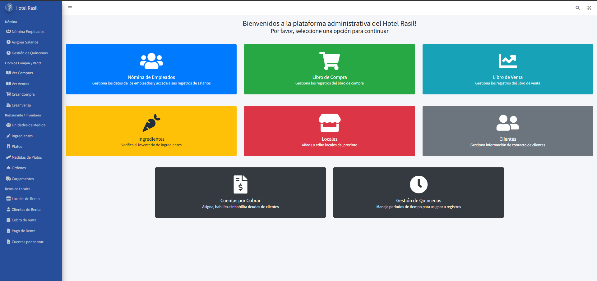
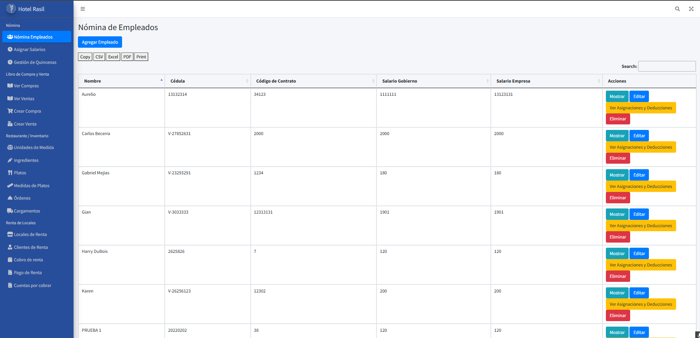
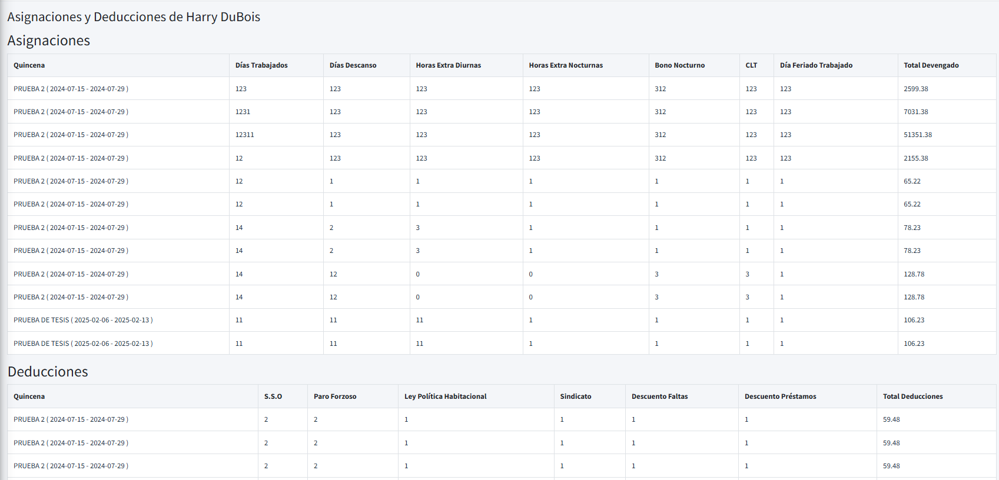
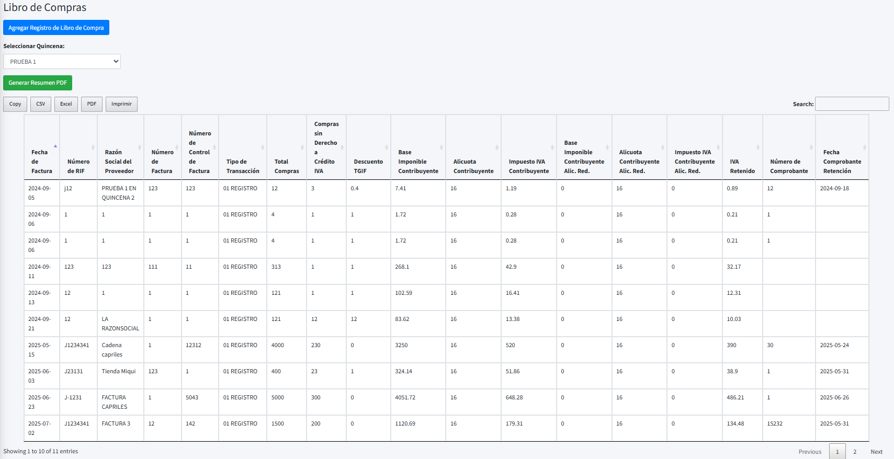
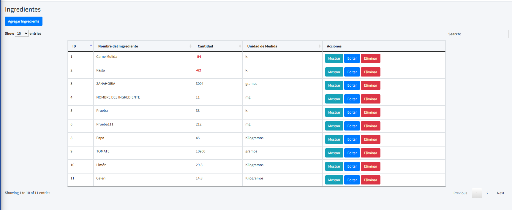
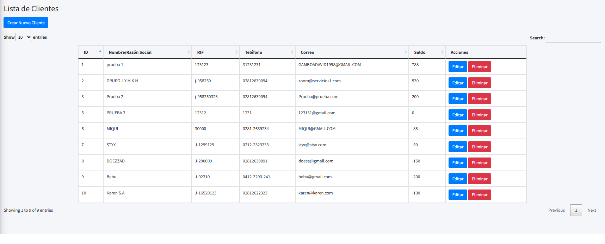
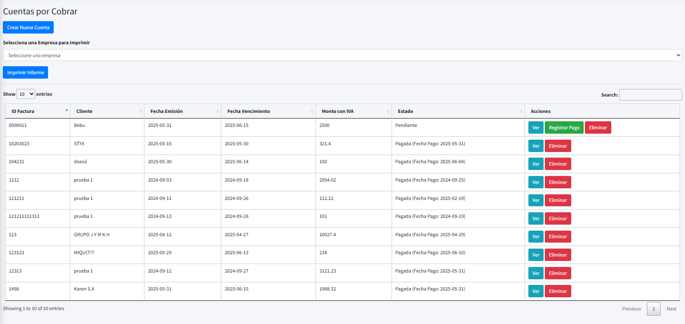
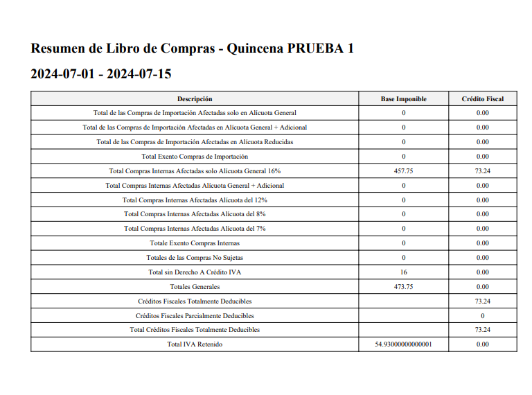

# Admin-Rasil

**Repositorio:** https://github.com/HasselGR/admin-rasil  


---

## Descripción
Admin-Rasil es una aplicación web desarrollada con Laravel diseñada para centralizar y automatizar los procesos administrativos del **Hotel Rasil** (Puerto La Cruz). El sistema reemplaza el manejo disperso de hojas de cálculo por una plataforma única que facilita la gestión de nómina, contabilidad, inventario del comedor, renta de locales y cuentas por cobrar, además de generación de reportes por periodos (quincenas). La implementación y el diseño se documentan en la tesis adjunta. 

---

## Características principales
- Gestión completa de **nómina**: agregar, editar, borrar empleados; registrar pagos, asignaciones y deducciones; cálculo de pagos por quincena. 
   
- Gestión de **quincenas**, **nómina de empleados** y periodos (quincenalmente) como unidad temporal para muchas transacciones (pagos, libros).  
- **Libro de Compras y Ventas**: añadir registros, consultar por periodo y generar reportes filtrados por quincena.  
- **Inventario Referencial** de insumos y gestión de comedor: unidades de medida, ingredientes, platos (relación muchos-a-muchos), cargos por órdenes y descuentos automáticos de inventario; gestión de cargamentos.   
- **Clientes y Cuentas por cobrar**: CRUD de clientes, creación/registro y conciliación de cuentas por cobrar, marcación como “pagado” y generación de reportes.       
- Búsqueda y filtros por periodo/quincena para facilitar auditoría y consultas históricas.   
- Interfaz basada en plantillas y componentes pensados para administración (Blade + AdminLTE / Bootstrap).
- Base de datos **relacional** lista para migrar y adaptar a nuevos ambientes a traves de comandos de lineas de interfaz (CLI), con relaciones bien definidas en sus modelos para fácil acceso.

---

## Tech stack
- **Backend:** PHP + Laravel (MVC). 
- **Base de datos:** PostgreSQL (modelado relacional, ER). 
- **Vistas / Frontend:** Blade (templating), Bootstrap y AdminLTE para UI administrativa. 
- **Testing / Calidad:** incluye pruebas unitarias e integración documentadas en la tesis (pruebas de nómina, libros, renta, cuentas por cobrar).
---


## Requisitos y preparación (local)
Requisitos mínimos (sugeridos):
- PHP 8.x compatible con la versión de Laravel usada
- Composer
- PostgreSQL (o la BD que defina `.env`)
- Node.js + npm (para assets con Vite / Mix)
- Opcional: Redis (cache/queue) y Supervisor para workers

Instalación local típica:
```bash
git clone https://github.com/HasselGR/admin-rasil.git
cd admin-rasil
composer install
cp .env.example .env
# editar .env (DB_HOST, DB_DATABASE, DB_USERNAME, DB_PASSWORD, APP_URL, MAIL_*)
php artisan key:generate
php artisan migrate --seed
npm install
npm run build   # o npm run dev para desarrollo
php artisan storage:link
php artisan serve --host=0.0.0.0 --port=8000
